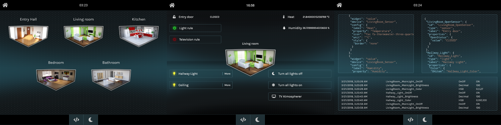
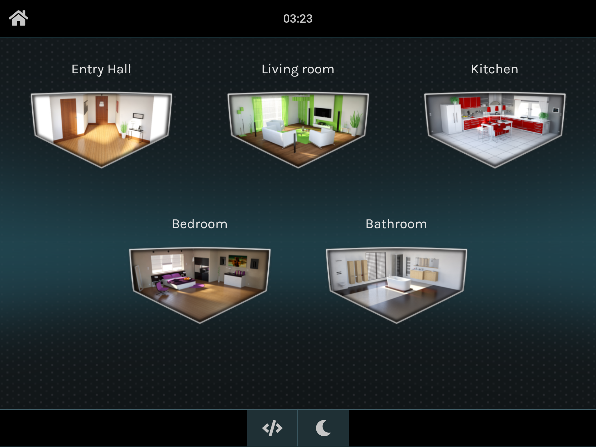
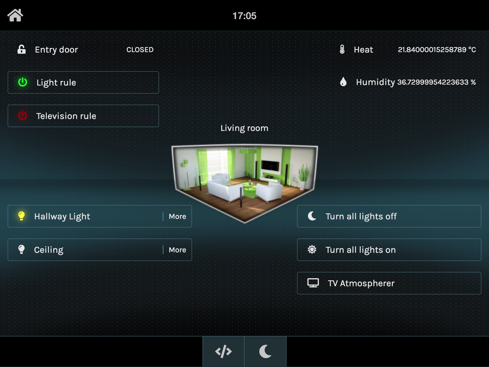
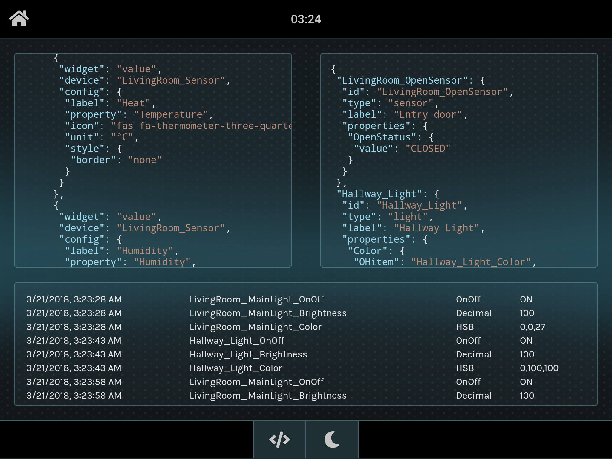

# Disclamer
This is a work in progress and has only been tested with my openHab installation and my 9" Nexus tablet.



# OpenHab Tablet Monitor

The goal of this project is to provide a nice web interface to be used on touchscreen to connect to openHab API.

## Setup

### openHab

Enter your openHab url and port in your environment.ts file. You can also defined others layout and devices files locations.

```javascript
export const environment = {
  production: false,
  app: {
    openHabUrl: 'http://192.168.1.25:8080',
    layout: '/assets/layout.json',
    devices: '/assets/devices.json'
  }
};
```


The user interface is generated with 2 json files

### Devices list
devices.json exemple

```json
{
"LivingRoom_OpenSensor": {
    "id": "LivingRoom_OpenSensor",
    "type": "sensor",
    "label": "Entry door",
    "properties": {
      "OpenStatus": {
        "value": ""
      }
    }
  },
  "Hallway_Light": {
    "id": "Hallway_Light",
    "type": "light",
    "label": "Hallway Light",
    "properties": {
      "Color": {
        "OHitem": "Hallway_Light_Color",
        "value": {
          "h": 0,
          "s": 0,
          "b": 0
        }
      },
      "Brightness": {
        "OHitem": "Hallway_Light_Brightness",
        "value": 0
      },
      "OnOff": {
        "OHitem": "Hallway_Light_OnOff",
        "value": ""
      }
    }
}
```

you can find a sample version of devices.json [here](src/assets/devices.json)
For the binding with OpenHome to work, the items in OpenHome MUST have their names as follow

```
LivingRoom_OpenSensor_OpenStatus
Hallway_Light_Color
Hallway_Light_Brightness
Hallway_Light_OnOff
```

### Layout
layout.json exemple

```json
{
  "rooms": {
    "LivingRoom": {
      "id": "LivingRoom",
      "label": "Living room",
      "icon": "lounge",
      "layout": {
        "areaA": [
          {
            "widget": "value",
            "device": "LivingRoom_OpenSensor",
            "config": {
              "property": "OpenStatus",
              "icon": "fas fa-unlock-alt",
              "style": {
                "border": "none"
              }
            }
          }
        ],
        "areaB": [
          {
            "widget": "value",
            "device": "LivingRoom_Sensor",
            "config": {
              "label": "Heat",
              "property": "Temperature",
              "icon": "fas fa-thermometer-three-quarters",
              "unit": "°C",
              "style": {
                "border": "none"
              }
            }
          },
          ...
        ],
        "areaC": [
          {
            "widget": "screen-light",
            "device": "LivingRoom_MainLight"
          },
          {
            "widget": "button",
            "device": "LivingRoom_AllLights",
            "config": {
              "label": "Turn all lights off",
              "property": "OnOff",
              "value": "OFF",
              "icon": "fas fa-moon"
            }
          }
        ],
        "areaD": []
      }
    }
  }
  ...
}
```
You can find a sampel version of layout.json file [here](src/assets/layout.json)

You should now see your romm appear on your home screen


A widget is defined by some mandatory and optional values :
* widget: The widget template (as of today : light, button, value. More to come :)
* device: The device used as key in devices.json
* confif (optional depending on the widget):
  * label: The default label is the one defined in the device.json. Can be override here
  * icon: A default icon exists. Can be override here
  * style: To override the widget css style

Some widgets also have some mandatory and optional values :
* button
  * property (mandatory): The property to bind
  * value (mandatory): The value to send when the button in clicked
* value
  * property (mandatory): The property to display
  * unit (optional): A text displayed right after the value



## Dashboard
You can see what your json look like (with live values) and your last updates received by clicking on the </> icon in the footer



## Inspiration

The user interface was inspired by [Calaos](https://calaos.fr/en/). The background and room images are also from the Calaos project.
